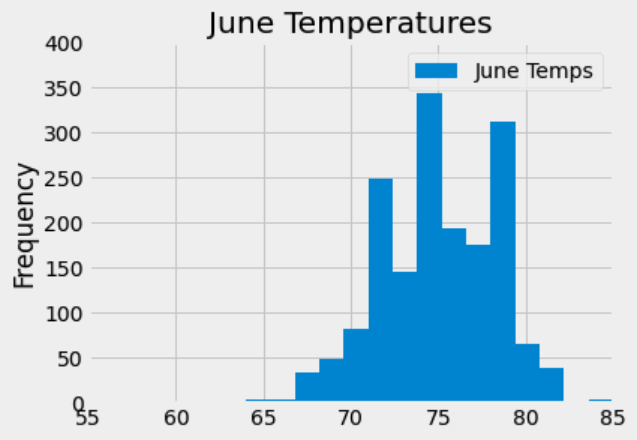
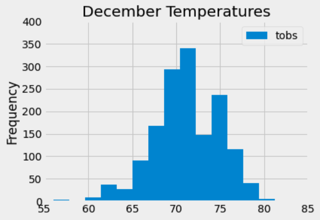

# Surfs_up

## Overview of the Analysis
The purpose of the analysis is analysis is to see temperature statistics for June and December to see if running a surf shop is sustainable year around. The way we get the temperature data is by running two seperate queries, one being for June and the other being December. 

## Results

_June Statistics for the Temperature and Precipitation_

_December Statistics for the Temperature and Precipitation_

The tables above show the weather patterns for June and December.
  
- Average temperature between June and December is 75 and 71 degrees respectively. And the precipitation average is 0.22 inches and 0.14 inches in December and June, respectevely. 
- The maximum temperatures of 85 (June) and 83 (December) are also almost similar.
- The minimum temperature of 56 (December) and 64 (June) show the greatest variance, and shows much lower temperature level in December. 
- However, with standard deviations of 3.25 (June) and 3.74 (December) little more variation should be expected in the numbers of the month December.

_June Temprature_

_December Temperature_

## Summary

To sum up it is important to say that the weather in December and June is very similar. The maximums of the month are very close to each other. However, the minimum of December is much lower than June's. The temperature data is not strongly skewed for either month. The ratio of the temperatures to the precipitation for the two months is also reasonably similar with few outliers over 3 inches of precipitation. The data supports opening a Surf and Ice Cream shop year-round.

*Additional queries included:*
- Percipitation level of June
- Percipitation level of December

